# 疫情申报微信小程序

## 参考文档

- [云开发文档](https://developers.weixin.qq.com/miniprogram/dev/wxcloud/basis/getting-started.html)

**提示：pic为图片目录，不用导入项目**

疫情以来，学校或者公司、什么机构，都会每天统计班上同学或者公司员工的健康状况，每天收集大家的活动地点、健康码或者健康宝截图之类的信息。很多机构还在使用excle的表格统计，非常麻烦，现在用微信小程序实现一个非常方便的系统，用于统计健康状况。后台可以直接导出表格信息。

程序大概是这个样子：

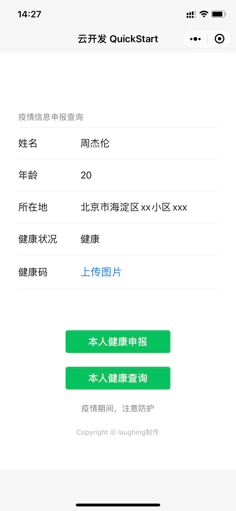


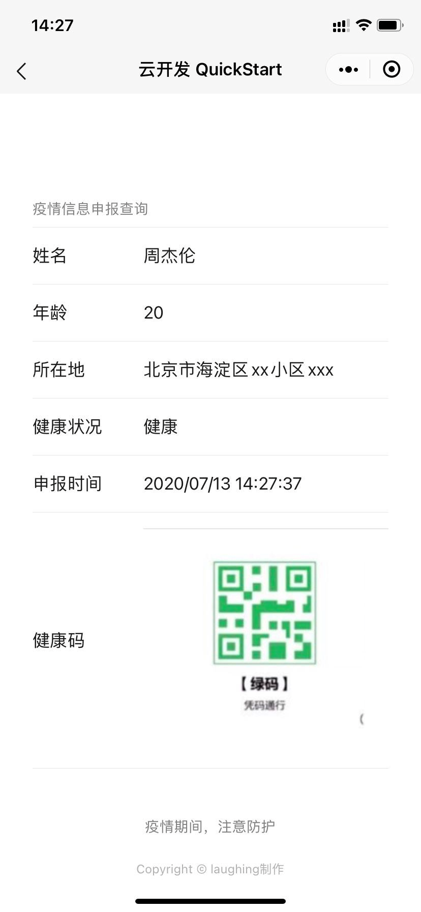


后台支持导出信息：

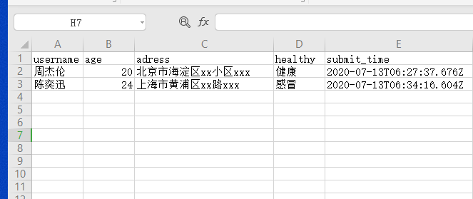

支持查看每个人的健康二维码等

虽然这个demo非常简单，但是却把基本的操作都走了一遍，读者可了解学习的我总结了一下就是：

1、如何使用云开发quickstart

2、如何引入小程序的外部组件库，实现更好看的样式。

3、如何操作小程序云数据库来进行数据存储、查询、crud那些。

4、如何使用小程序的云存储（这里以上传一张图片、健康码为例）

## 准备工作

可以先参考我之前发布的手机号归属地查询小程序：

https://zhuanlan.zhihu.com/p/126343047

- 1、**申请账号**

  申请账号的地址 https://mp.weixin.qq.com/wxopen/waregister?action=step1

  个人开发的话，虽然一个人名下可以有五个小程序，但一个邮箱只能对应管理一个小程序。 如果你想开发多个，还得多用几个邮箱，非常麻烦。

    按流程注册完成之后，会有一个**AppID(小程序ID)**，这个ID很重要。在IDE创建项目和项目上线都是需要的。 

- 2、**安装开发者工具IDE**

  https://developers.weixin.qq.com/miniprogram/dev/devtools/download.html

     我这里用的是稳定版 Stable Build。微信的IDE界面还行，但是拓展功能很差，快捷键支持的也不多，不是特别好用 。我大致给画一下区域

  

- 3、**基本认识**

  这里我们首先要认识四种文件类型 **json、、js、wxml、wxss**。
  json和js大家都很熟悉了，微信小程序用json存储数据或是写配置信息等。js用来写JavaScript。 令人好奇的是wxml、wxss到底是什么东西，大家都很熟悉HTML + CSS + JS的模式。实际上wxml就是html,而wxss就是写样式的css。 wxml也有类似vue的那种{{}}绑定数据的方法。wxss增加了一个rpx的计量单位，方便手机操作。我发现这套模式对有的原生html写法 有很多不兼容的地方，还得考虑安卓和ios的兼容性问题等。我们只是做一个demo的话、暂时不去学这些东西，就当作HTML + CSS + JS的模式 去写吧，遇到具体的问题再具体解决。

  微信小程序有一个主配置文件就是app.json，我们可以看出来是配置index和背景样式之类的东西，这里我们暂时不用改这些。 

## 开发过程

### 一、新建项目

新建项目，输入在申请账号、开发中申请到的AppID。

不同于上次，这次需要使用数据库，注意一定要勾选小程序云开发。

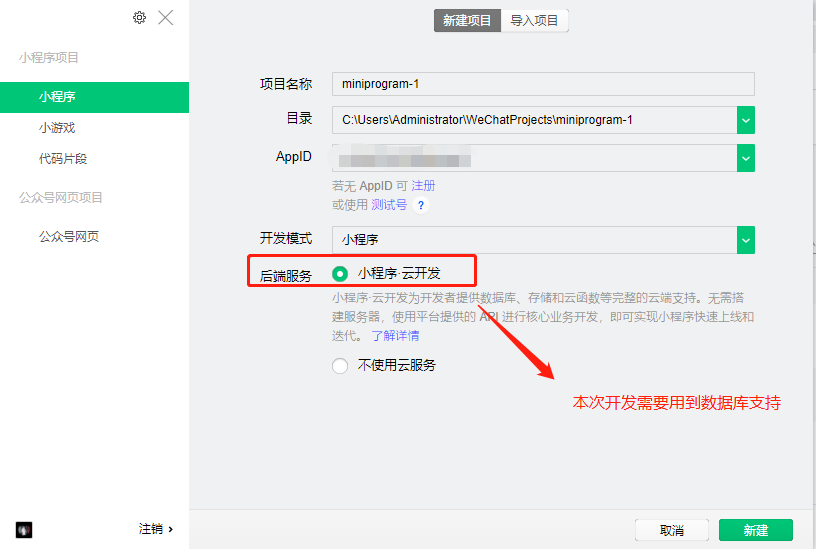

新建完成后，会生成一个云开发QuickStart的项目，已经写好了一些简单的样例，如上传图片、操作数据库等。可以想看看样例是如何实现这个功能的。

这是云开发的快速启动指引，其中演示了如何上手使用云开发的三大基础能力：

\- 数据库：一个既可在小程序前端操作，也能在云函数中读写的 JSON 文档型数据库

\- 文件存储：在小程序前端直接上传/下载云端文件，在云开发控制台可视化管理

\- 云函数：在云端运行的代码，微信私有协议天然鉴权，开发者只需编写业务逻辑代码

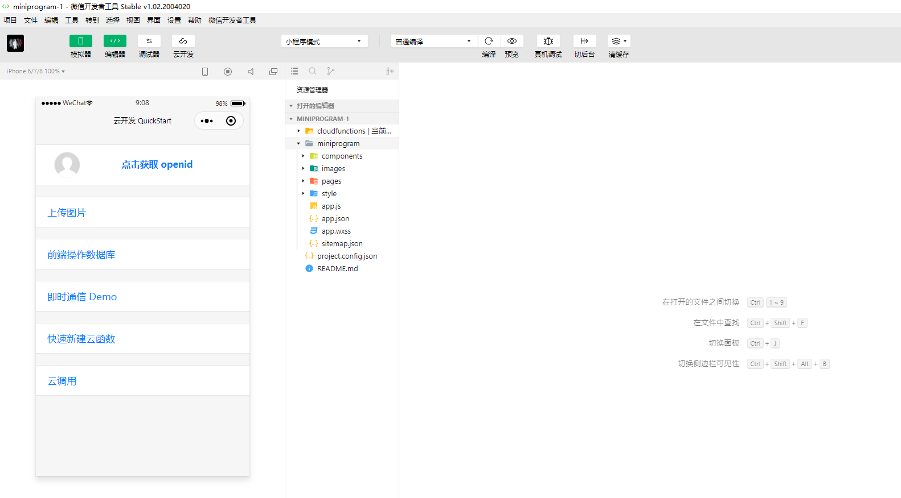


### 二、数据库配置

因为我们这次主要是需要进行增删改查的数据库操作，我们需要使用云开发模式，首先需要了解微信的云数据库。

云开发提供了一个 JSON 数据库，顾名思义，数据库中的每条记录都是一个 JSON 格式的对象。一个数据库可以有多个集合（相当于关系型数据中的表），集合可看做一个 JSON 数组，数组中的每个对象就是一条记录，记录的格式是 JSON 对象。如果不懂需要花个半小时学习一下JSON 。

其次我们需要了解数据库中的openid字段。

每条记录都有一个 `_id` 字段用以唯一标志一条记录、一个 `_openid` 字段用以标志记录的创建者，即小程序的用户。需要特别注意的是，在管理端（控制台和云函数）中创建的不会有 `_openid` 字段，因为这是属于管理员创建的记录。开发者可以自定义 `_id`，但不可自定义和修改 `_openid` 。`_openid` 是在文档创建时由系统根据小程序用户默认创建的，开发者可使用其来标识和定位文档。

所以在开发中我们需要有一个openid才能进行直接的数据库操作。**需要在cloudfunctions目录下，右键login文件夹上传并部署所有文件**

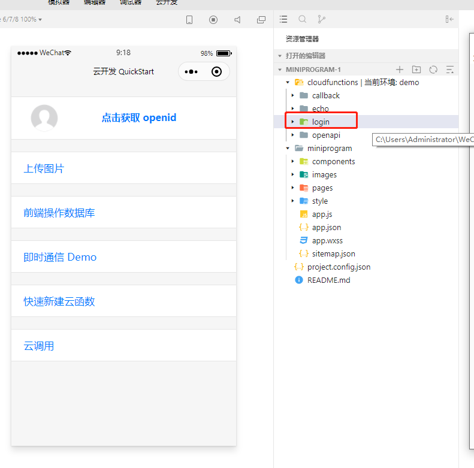


在云开发中，我们即可操作数据库。

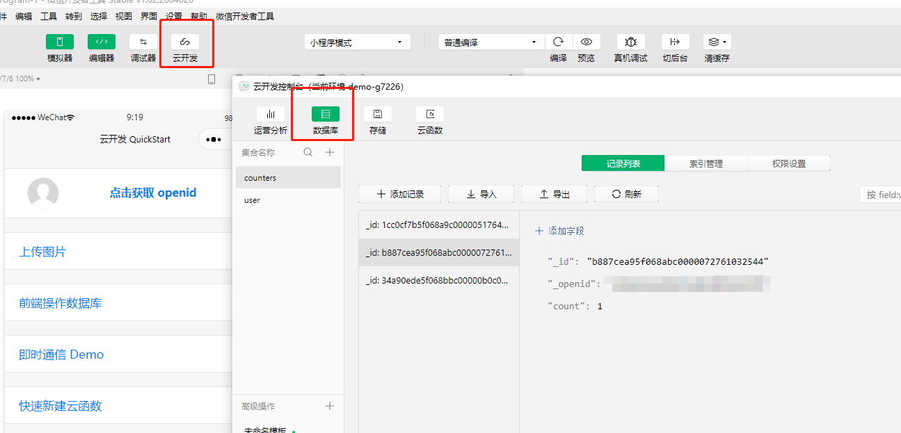

我们新建一个user_info的集合（表）来存储申报的数据：

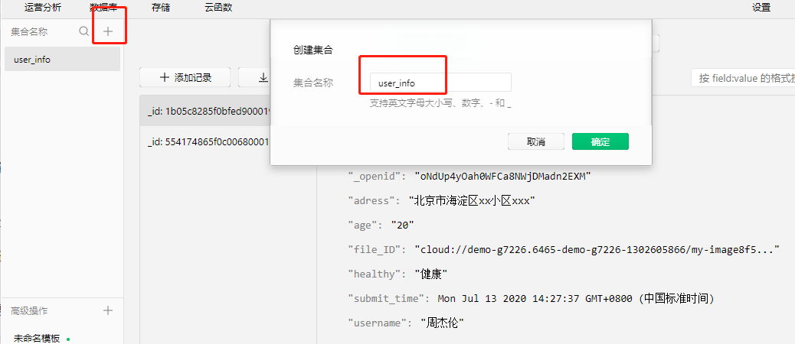


### 三、引入*WeUI* 

为了美观起见，我们引入一个样式的组件库。

*WeUI* 是一套同微信原生视觉体验一致的基础样式库,由微信官方设计团队为微信内网页和微信小程序量身设计,令用户的使用感知更加统一。

可以在weui官网查看具体的样式库，基本和微信原生一模一样。

官网：[https://weui.io](https://weui.io)


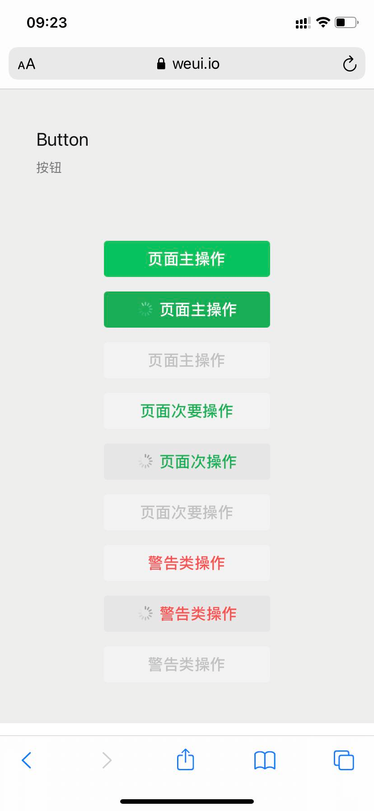


如何使用呢？在github上下载master版本的weui组件：[https://github.com/Tencent/weui-wxss?from=timeline&isappinstalled=0&utm_source=tuicool&utm_medium=referral](https://github.com/Tencent/weui-wxss?from=timeline&isappinstalled=0&utm_source=tuicool&utm_medium=referral)

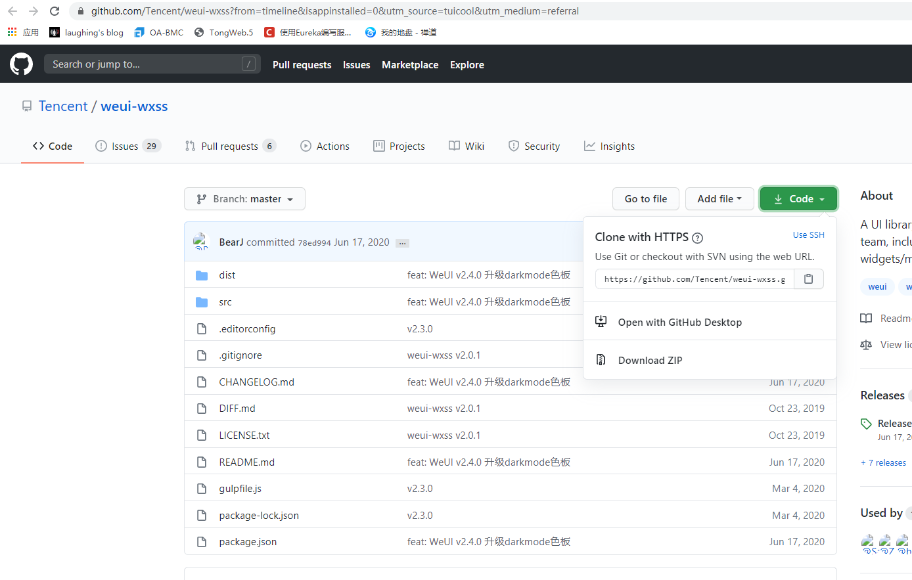


将weui.wxss的样式文件复制到项目根目录下，直接拖拽即可


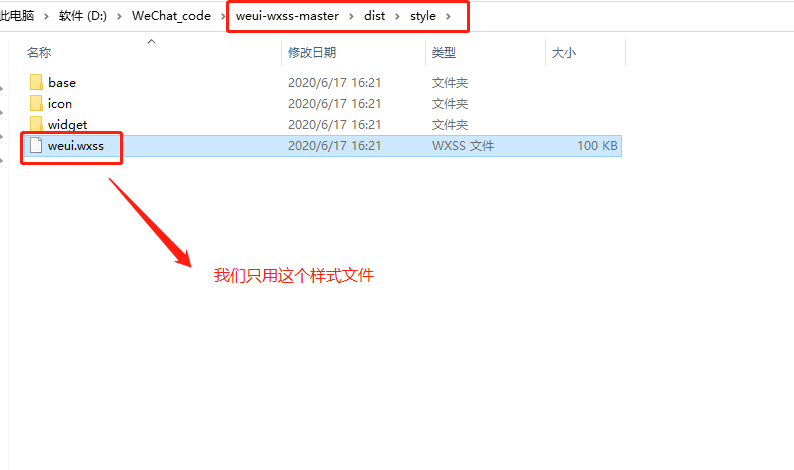

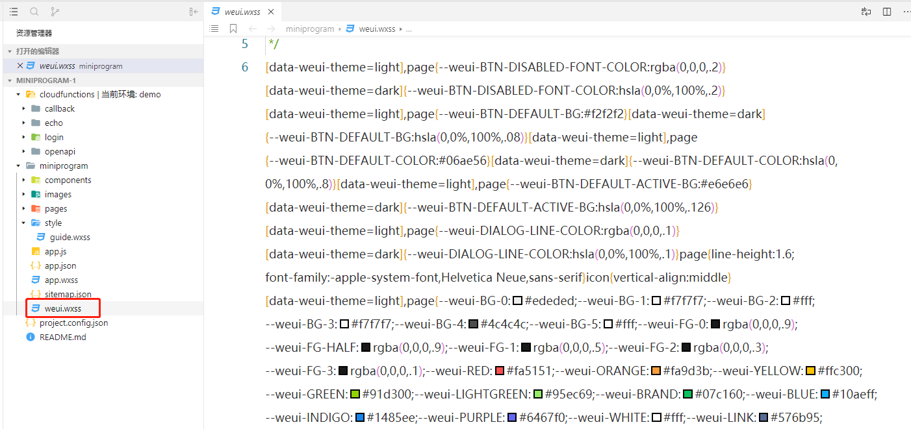


在app.wxss中引用即可！

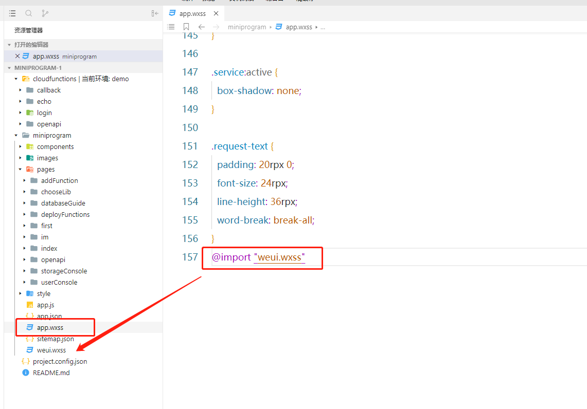

### 四、第一个页面

新建第一个页面，并在app.json配置文件中的pages声明，注意需要放置在第一个。


**wxml页面：**

**表单：**

```
<view class="weui-cell weui-cell_active">
    <view class="weui-cell__hd">
        <label class="weui-label">姓名</label>
    </view>
    <view class="weui-cell__bd">
        <input class="weui-input" placeholder="请填写本人姓名" placeholder-class="weui-input__placeholder" bindinput="getusernameInput" value="{{username}}"/>
    </view>
</view>
```

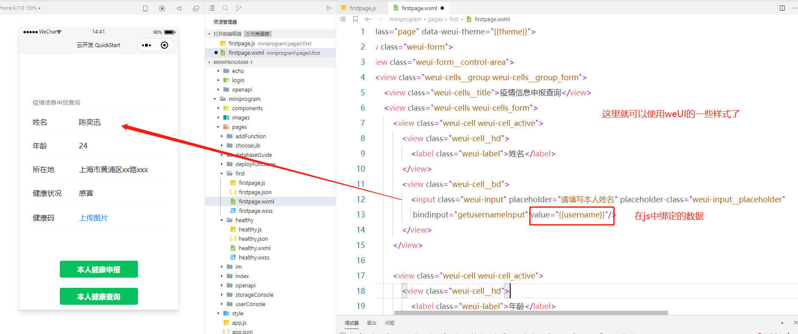

**选择框：**


```
<view class="weui-cell weui-cell_active">
    <view class="weui-cell__hd">
        <label class="weui-label">健康状况</label>
    </view>
    <view class="weui-cell__bd">
        <picker bindchange="bindPickerChange" value="{{healthy_index}}" range="{{healthy_array}}">
            <input class="weui-input" placeholder="请选择本人健康状况" placeholder-class="weui-input__placeholder" bindinput="gethealthyInput" value="{{healthy}}" disabled/>
        </picker>
    </view>
</view>
```

选择框需要在data里面声明，以数组的形式：

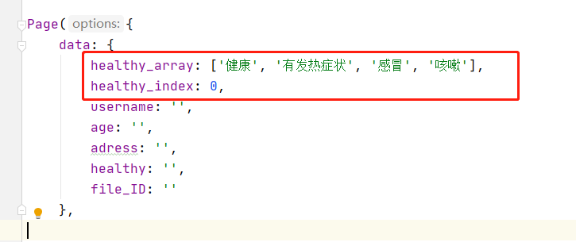

**按钮**：

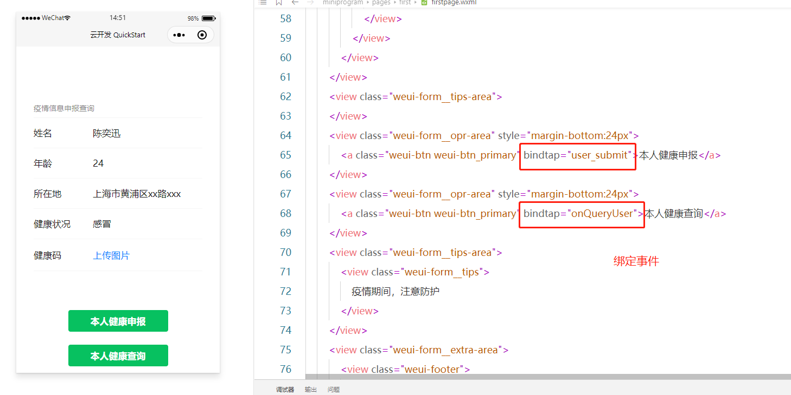

### 五、上传图片功能实现

微信提供云存储的功能，我直接将实现代码贴上来，以供参考。

```
// 上传图片
doUpload: function () {
    var that = this;
    // 选择图片
    wx.chooseImage({
        count: 1,
        sizeType: ['compressed'],
        sourceType: ['album', 'camera'],
        success: function (res) {

            wx.showLoading({
                title: '上传中',
            })
            const filePath = res.tempFilePaths[0]
            // 上传图片
            const cloudPath = 'my-image' + that.wxuuid() + filePath.match(/\.[^.]+?$/)[0]
            wx.cloud.uploadFile({
                cloudPath,
                filePath,
                success: res => {
                    console.log('[健康码上传] 成功：', res)
                    wx.showToast({
                        icon: 'none',
                        title: '上传成功',
                    })
                    app.globalData.fileID = res.fileID
                    app.globalData.cloudPath = cloudPath
                    app.globalData.imagePath = filePath
                    that.setData({
                        file_ID: res.fileID
                    })
                },
                fail: e => {
                    console.error('[健康码上传] 失败：', e)
                    wx.showToast({
                        icon: 'none',
                        title: '上传失败',
                    })
                },
                complete: () => {
                    wx.hideLoading()
                }
            })

        },
        fail: e => {
            console.error(e)
        }
    })
},
```

文件的云端生成路径即为const cloudPath = 'my-image' + that.wxuuid() + filePath.match(/\.[^.]+?$/)[0]

that.wxuuid()为一个为图片生成唯一uuid的标识：

```
// 生成uuid
    wxuuid: function () {
        var s = [];
        var hexDigits = "0123456789abcdef";
        for (var i = 0; i < 36; i++) {
            s[i] = hexDigits.substr(Math.floor(Math.random() * 0x10), 1);
        }
        s[14] = "4"; // bits 12-15 of the time_hi_and_version field to 0010
        s[19] = hexDigits.substr((s[19] & 0x3) | 0x8, 1); // bits 6-7 of the clock_seq_hi_and_reserved to 01
        s[8] = s[13] = s[18] = s[23] = "-";
        var uuid = s.join("");
        return uuid
    }
```


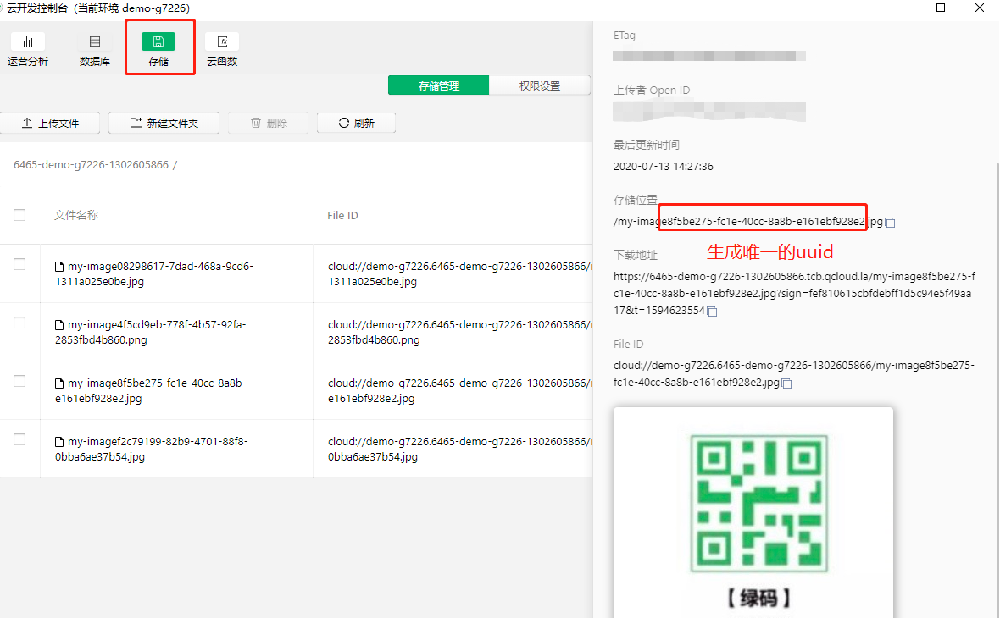

### 六、信息存储实现

表单已经实现，现在需要实现将信息存入数据库，我们这里除了页面上的姓名、年龄、所在地、健康状况的存储信息外，还需要一个申报时间submit_time和个人上传的健康码的存储路径。

下面是存进来一个数据项目，openid隐去。

```
{
    "_id": "1b05c8285f0bfed9000196c252f4e14d",
    "adress": "北京市海淀区xx小区xxx",
    "age": "20",
    "file_ID": "cloud://demo-g7226.6465-demo-g7226-1302605866/my-image8f5be275-fc1e-40cc-8a8b-e161ebf928e2.jpg",
    "healthy": "健康",
    "submit_time": {
    "$date": "2020-07-13T06:27:37.676Z"
},
    "username": "周杰伦",
    "_openid": "xxxxxxxxxxxx"
}
```

存储方法：

```
// 本人健康申报
user_submit: function () {
    if (this.data.file_ID == '') {
        wx.showToast({
            icon: 'none',
            title: '请上传健康码'
        })
        return;
    }
    if (this.data.username == '' || this.data.age == ''
        || this.data.adress == '' || this.data.healthy == '') {
        wx.showToast({
            icon: 'none',
            title: '请将信息全部填写完成'
        })
        return;
    }
    const db = wx.cloud.database()
    db.collection('user_info').add({
        data: {
            username: this.data.username,
            age: this.data.age,
            adress: this.data.adress,
            healthy: this.data.healthy,
            file_ID: this.data.file_ID,
            submit_time: new Date()
        },
        success: res => {
            // 在返回结果中会包含新创建的记录的 _id
            wx.showToast({
                title: '申报成功',
            })
            console.log('[数据库] [新增记录] 成功，记录 _id: ', res._id);
            console.log(res);
        },
        fail: err => {
            wx.showToast({
                icon: 'none',
                title: '新增记录失败'
            })
            console.error('[数据库] [新增记录] 失败：', err)
        }
    })
},
```

同时，还增加了必填的校验，如果不上传就申报会有提示并且返回：

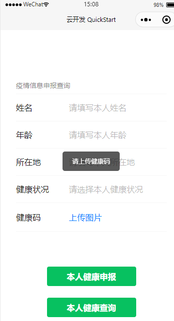

### 七、个人信息查询

查询功能首先需要一个页面跳转的功能：

```
onQueryUser: function () {
    wx.navigateTo({
        url: '../healthy/healthy'
    })
},
```

还需要在配置文件中添加路径，并新建一个健康查询的模块：

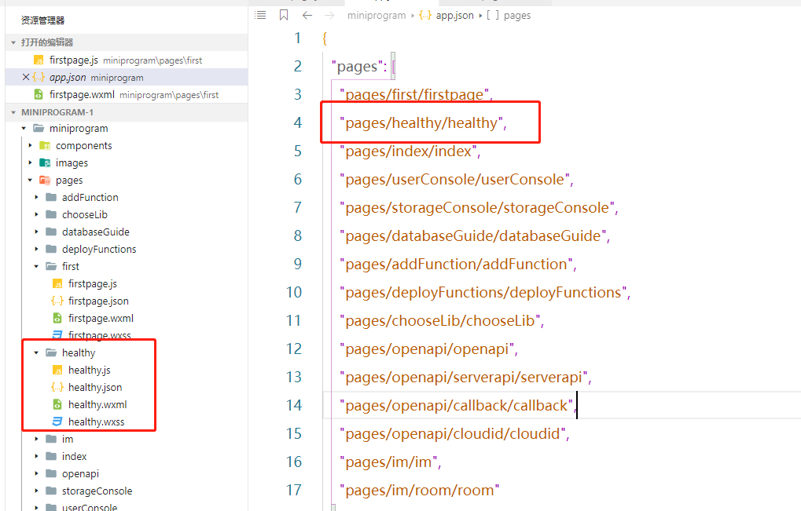

页面需要做一些改动：

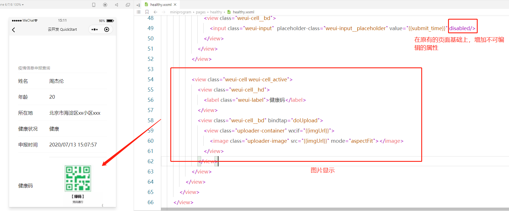


在js页面添加一个onShow的函数，读者可自行了解这些函数的声明周期。onShow在每次新页面加载都会重写请求。

```
onShow: function () {
    const db = wx.cloud.database()
    // 查询当前用户所有的 counters
    db.collection('user_info').where({
        _openid: this.data.openid,
    }).orderBy('submit_time', 'desc').get({
        success: res => {
            console.log(res)
            this.setData({
                age: res.data[0].age,
                adress: res.data[0].adress,
                username: res.data[0].username,
                healthy: res.data[0].healthy,
                imgUrl:  res.data[0].file_ID,
                submit_time: this.formatTime(res.data[0].submit_time),
            })
            console.log('[数据库] [查询记录] 成功: ', res)
        },
        fail: err => {
            wx.showToast({
                icon: 'none',
                title: '查询记录失败'
            })
            console.error('[数据库] [查询记录] 失败：', err)
        }
    })
},
```

由于数据库是时间戳的形式存储，我们还需要转换成人能看懂的形式。


至此，大致的功能就全部实现。

## 结语

虽然这个demo非常简单，但是却把基本的操作都走了一遍，读者可了解学习的我总结了一下就是：

1、如何使用云开发quickstart

2、如何引入小程序的外部组件库，实现更好看的样式。

3、如何操作小程序云数据库来进行数据存储、查询、crud那些。

4、如何使用小程序的云存储（这里以上传一张图片、健康码为例）

实际上学到这里，根据业务或系统的复杂程度不一样，大部分功能都可以基于这些技术进行实现。建议先参考我的上一篇手机号归属地查询小程序：https://zhuanlan.zhihu.com/p/126343047了解一些基础概念再来学习。


